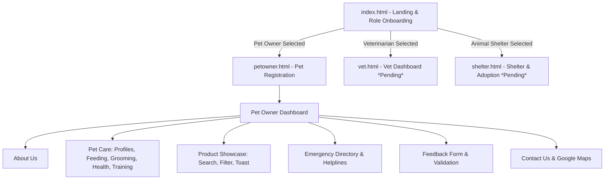

# 🐾 FurEver Care — Project Status Report

**Project Title:** FurEver Care (*"They Deserve Forever Love"*)  
**Category:** Responsive NextGen Web Application / Pet Care Portal  
**Document Generated:** August 25, 2026  
**Curriculum Reference:** Aptech Responsive Website Development SRS  

---

## 📌 Executive Summary

**FurEver Care** is a modern, responsive single-page/multi-module pet care portal designed to bridge the needs of **Pet Owners**, **Veterinarians**, and **Animal Shelters**.

The project currently has a fully functional **Landing & Onboarding Engine** and an extensive **Pet Owner Portal**, implementing modern UI/UX principles (Tailwind CSS, glassmorphism, animated interactions, responsive drawers, client-side persistence, and HTML5 Geolocation). 

The remaining modules (**Veterinarian Dashboard** and **Animal Shelter & Adoption Portal**) are scoped and ready for implementation.

---

## 🗂️ Project File Structure & Inventory

| File | Type | Lines / Size | Current Status | Description |
| :--- | :--- | :--- | :--- | :--- |
| [`index.html`](file:///c:/Users/assau/OneDrive/Desktop/Techwiz/index.html) | HTML5 | 239 lines (~16 KB) | ✅ Complete | Landing page, brand hero, floating input, role selection cards, welcome transition screen. |
| [`script.js`](file:///c:/Users/assau/OneDrive/Desktop/Techwiz/script.js) | JavaScript | 111 lines (~4.1 KB) | ✅ Complete | Onboarding logic, profile selection state, dynamic button validation, session storage, routing. |
| [`petowner.html`](file:///c:/Users/assau/OneDrive/Desktop/Techwiz/petowner.html) | HTML5 | 594 lines (~39.4 KB) | ✅ Complete | Pet registration form + comprehensive Pet Owner dashboard with 6 main tabbed sections. |
| [`petowner.js`](file:///c:/Users/assau/OneDrive/Desktop/Techwiz/petowner.js) | JavaScript | 260 lines (~13.2 KB) | ✅ Complete | Pet profile persistence, tab navigation, product catalog filtering/search, ticker, geolocation, visitor counter, toast alerts. |
| `PetCare_Website Design and Development-SRS_final.pdf` | PDF | ~1.5 MB | 📄 Reference | Official Software Requirements Specification (SRS) document. |
| [`srs_extracted.txt`](file:///c:/Users/assau/OneDrive/Desktop/Techwiz/srs_extracted.txt) | Text | 296 lines (~13.8 KB) | 📄 Reference | Plain-text extract of all requirements, sitemaps, constraints, and deliverables from SRS. |
| `vet.html` / `vet.js` | HTML / JS | *Not created* | ⏳ Pending | Veterinarian registration, profile, appointment slot schedule, medical history case studies. |
| `shelter.html` / `shelter.js` | HTML / JS | *Not created* | ⏳ Pending | Adoptable pet gallery, species filter, adoption success stories, events, shelter map. |
| `data/` (JSON files) | JSON | *Optional / Inlined* | ⏳ Next Steps | Standalone JSON dataset for products, pets, and vet schedules to satisfy external JSON loading requirements. |

---

## 🎯 Requirements Compliance Matrix (SRS vs. Implementation)

### 1. General & Navigation Features
| Feature / Requirement | SRS Reference | Status | Notes / Implementation Details |
| :--- | :--- | :---: | :--- |
| **Welcome Message & Name Display** | Sec 1.6 (Page 9) | ✅ Complete | Accepts first name on landing page; displays personalized welcome and stores in `localStorage`. |
| **Role / Persona Selection** | Sec 1.6 (Page 9) | ✅ Complete | Interactive cards for *Pet Owner*, *Veterinarian*, and *Animal Shelter* with animated selection badges. |
| **Responsive Single Page Experience** | Sec 1.6 (Page 9) | ✅ Complete | Tabbed modular views, mobile sliding hamburger navigation, clean responsive layouts. |
| **Real-time Clock & Geolocation Ticker** | Sec 1.6 (Page 10, 11) | ✅ Complete | Running ticker displaying HTML5 coordinates, live clock (`HH:MM:SS`), and rotating announcements. |
| **Simulated Visitor Counter** | Sec 1.6 (Page 11) | ✅ Complete | Persistent counter incremented on dashboard visit and rendered in the footer. |
| **Design Aesthetics & Theme** | Sec 1.6 (Page 9) | ✅ Complete | Custom warm palette (`oceanteal`, `softcoral`, `creambg`, `sageaccent`), Nunito typography, glassmorphism, animated ambient blobs. |

---

### 2. Pet Owner Module (`petowner.html` + `petowner.js`)
| Section / Sub-feature | SRS Reference | Status | Details |
| :--- | :--- | :---: | :--- |
| **Pet Info Onboarding Form** | Sec 1.6 (Page 9) | ✅ Complete | Collects pet name, species, breed, and age with floating label UI. |
| **Pet Profile Display** | Sec 1.6 (Page 10) | ✅ Complete | Displays dynamic pet badge in navbar + dedicated profile overview card with vaccination records. |
| **Feeding Guide** | Sec 1.6 (Page 10) | ✅ Complete | Structured meal guides & dietary recommendations for Puppies/Kittens, Adults, and Seniors. |
| **Grooming Videos** | Sec 1.6 (Page 10) | ✅ Complete | Interactive video preview cards for Brushing, Bathing, and Trimming/Clipping. |
| **Health Tips (Audio + Text)** | Sec 1.6 (Page 10) | ✅ Complete | Audio player mockup (Oral Care) + advice cards on Weight Management, Dental Health, Allergies, and Parasites. |
| **Training Tips (Audio + Text)** | Sec 1.6 (Page 10) | ✅ Complete | Audio guide (Obedience Training) + step-by-step guides for *Sit & Stay*, *Leash Walking*, *House Training*. |
| **Pet Product Showcase** | Sec 1.6 (Page 10) | ✅ Complete | 12 curated products across 5 categories (Food, Toys, Grooming, Bedding, Supplements) with real-time text search and category filters. |
| **"Buy Now" Non-functional Buttons** | Sec 1.6 (Page 10) | ✅ Complete | Interactive button triggering toast notification ("*Added — checkout coming soon*"). |
| **Emergency & Vet Help** | Sec 1.6 (Page 11) | ✅ Complete | Veterinarian directory table + emergency 24/7 poison & rescue helplines. |
| **Feedback Form (UI Only)** | Sec 1.6 (Page 11) | ✅ Complete | Floating label form with interactive submission animation and reset cycle. |
| **Contact Us & Map** | Sec 1.6 (Page 11) | ✅ Complete | Contact info cards + embedded responsive Google Maps iframe. |
| **About Us Section** | Sec 1.6 (Page 11) | ✅ Complete | Dedicated company mission, vision, and team info. |

---

### 3. Veterinarian Module (`vet.html`) — *Planned*
| Feature | SRS Reference | Status | Scope / Requirements |
| :--- | :--- | :---: | :--- |
| **Vet Onboarding Form** | Sec 1.6 (Page 11) | ⏳ Pending | Collect Vet Name, Specialization, Contact Info, and Profile Image / Avatar. |
| **Vet Profile Dashboard** | Sec 1.6 (Page 11) | ⏳ Pending | Persistent header with Vet's name and specialization badge. |
| **Appointment Time Slots** | Sec 1.6 (Page 11) | ⏳ Pending | Visual calendar/slot grid displaying Booked vs. Available consultation slots. |
| **Pet Medical Histories** | Sec 1.6 (Page 11) | ⏳ Pending | Case studies / treatment records display (e.g., vaccination histories, past diagnoses, treatment logs). |

---

### 4. Animal Shelter Module (`shelter.html`) — *Planned*
| Feature | SRS Reference | Status | Scope / Requirements |
| :--- | :--- | :---: | :--- |
| **Adoptable Pet Gallery** | Sec 1.6 (Page 12) | ⏳ Pending | Card gallery of rescue animals (Photo/Emoji, Name, Age, Breed, Bio, Status). |
| **Client-side Pet Filters** | Sec 1.6 (Page 12) | ⏳ Pending | Filter pets dynamically by species (Dogs, Cats, Rabbits, Others) using vanilla JS. |
| **Success Stories** | Sec 1.6 (Page 12) | ⏳ Pending | Story cards showcasing past adoption journeys with before/after photos and testimonials. |
| **Static Event Announcements** | Sec 1.6 (Page 12) | ⏳ Pending | Cards for upcoming Adoption Drives, Vaccination Camps, and Volunteer Days. |
| **Shelter Contact & Map** | Sec 1.6 (Page 12) | ⏳ Pending | Shelter operating hours, physical address, volunteer contact info, and Google Map. |

---

## 🎨 Design System & Technical Architecture

### Color Palette Tokens
- **Ocean Teal (`#2C6E6B`)**: Primary brand color, headers, key actions, badges.
- **Soft Coral (`#F4A896`)**: Secondary brand accent, highlights, gradients, CTA buttons.
- **Cream Background (`#FBF3E8`)**: Warm, friendly light background reducing visual fatigue.
- **Sage Accent (`#A8C3A0`)**: Muted secondary accent for borders, success states, and subtle badges.

### Technology Stack
- **Frameworks / Libraries:** Semantic HTML5, Tailwind CSS (via CDN), Vanilla JavaScript (ES6+).
- **Typography:** Google Fonts (`Nunito: 300, 400, 600, 700, 800, 900`).
- **Persistence:** Browser `localStorage` (Session simulation for user name, role, pet profile, and visitor counts).
- **APIs:** HTML5 Geolocation API, Google Maps Embed API.

---

## 🚀 Recommended Next Steps & Roadmap

1. **Build the Veterinarian Module (`vet.html` & `vet.js`)**:
   - Create the onboarding form for veterinarians (name, specialization, license/clinic details).
   - Build the Vet Dashboard with appointment scheduling slots (available/booked) and interactive medical case study cards.
2. **Build the Animal Shelter Module (`shelter.html` & `shelter.js`)**:
   - Create adoptable pets catalog with dynamic species filtering (Dogs, Cats, Rabbits).
   - Add adoption success stories and upcoming event announcements (Vaccination drives, weekend adoption camps).
3. **Data Refactoring (Optional Enhancement)**:
   - Extract product and adoption listings into external `products.json` and `pets.json` files loaded via `fetch()`, strictly mirroring the JSON requirement in Section 1.5 of the SRS.
4. **Project Deliverables Preparation**:
   - Prepare final documentation (DFD diagrams, Flowcharts, ReadMe) for the final project submission package.
